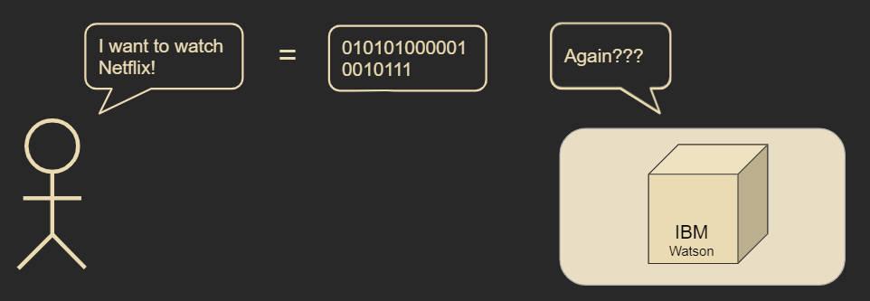

```{r setup, include=FALSE}
options(htmltools.dir.version = FALSE)
```

```{r xaringan-themer, include=FALSE, warning=FALSE}
library(xaringanthemer)
library(xaringanExtra)
library(tidyverse)
library(knitr)
library(nomnoml)
library(countdown)
xaringanExtra::use_logo(
  image_url = "https://raw.githubusercontent.com/rstudio/hex-stickers/master/PNG/xaringan.png"
)
xaringanExtra::use_panelset()
xaringanExtra::use_broadcast()
xaringanExtra::use_share_again()
xaringanExtra::style_share_again(share_buttons = c("twitter", "linkedin"))
xaringanExtra::use_tachyons()
xaringanExtra::use_fit_screen()
xaringanExtra::use_tile_view() # O
style_mono_accent(
  base_color = "#0dc96f",
  background_color = "#ffffff",
  inverse_background_color = "#3298cb",
  header_color = "#022044",
  inverse_header_color = "#ffffff", 
  inverse_text_color = "#ffffff",
  code_inline_color = "#179c55",
  link_color= "#A406B2",
  text_font_size = "25px",
  header_font_google = google_font("Poppins", "Regular", "400"),
  text_font_google   = google_font("Darker Grotesque", "500"),
  code_font_google   = google_font("Fira Mono"),
  )

```

```{r metathis, warning=FALSE, echo=FALSE}
library(metathis)
meta() %>%
  meta_name("github-repo" = "flor14/rladies-jujuy") %>% 
  meta_social(
    title = "Meetup R-Ladies Jujuy",
    description = paste(
      "Mi próximo artículo científico con R:", 
      "Compendios de Investigación, Reproducibilidad e",
      "Interactividad en las publicaciones académicas"
    ),
    url = "https://flor14.github.io/rladies-jujuy/presentacion.html?panelset=licencia#1",
    image = "https://res.cloudinary.com/flor/image/upload/v1608248822/jujuy-colores_frmvax.jpg",
    image_alt = paste(
      "Charla para el capítulo de R-Ladies de Jujuy, Argentina.",
      "Diciembre de 2020"
      ),
    og_type = "website",
    og_author = "Florencia D'Andrea",
    twitter_card_type = "summary_large_image",
    twitter_creator = "@cantoflor_87",
    twitter_site = "@cantoflor_87"
  )
```


---
class: inverse, middle, center


Do you have your coffee? (if you like it) ☕ 

### Starting in ...
`r countdown(minutes = 5)`


---


class: bottom

.bg-washed-blue.b--dark-blue.ba.bw2.br3.shadow-5.ph4.mt5[
### DSCI 521 - Lecture 1
### **Shell, Git, GitHub**

 .large[#### Computing Platforms for Data Science - UBC MDS 2021/22
]]

---

## Lecture 1


#### * Software used in MDS

--

#### * Use Bash to navigate the computer's file system
    - Absolute and relative file paths
    
--

#### * Git for version control
    - Including clone, add, commit, pull, and push
    - Access, edit and submit assignments via GitHub.

---

## The MDS software stack

class: middle

### * Bash
### * Git
### * Python and R
### * VS code, JupyterLab, and RStudio

---

class: middle, center, inverse

## Open Source programs

Anyone can read the source code and contribute to these projects


---

class: middle, center, inverse

# Introduction to Computing

---

```{r women, fig.align='center', echo = FALSE, out.width=700} 
    
```
.footnote[Ester Gerston and Gloria Gordon (1946) U.S. Army/ARL Technical Library Archives] 
    
---


## Computer comunication

```{r cym2, fig.align='center', echo = FALSE, out.width=700} 
    
```

---

class: middle, center, inverse

# Advantages of text-based shells

* Facilitate human interaction with the computer


---

```{r t1, fig.align='center', echo = FALSE, out.width=400} 
    knitr::include_graphics("img/win-terminals.png")
```

```{r t2, fig.align='center', echo = FALSE, out.width=400} 
    knitr::include_graphics("img/mac-terminal.png")
```

.footnote[[Command line crash course - Mozilla](https://developer.mozilla.org/en-US/docs/Learn/Tools_and_testing/Understanding_client-side_tools/Command_line)
] 
   

---

```{r cym, fig.align='center', echo = FALSE, out.width=700} 
    
```

---


### Graphical User Interfaces are nice when you are new to something, but text based interfaces are actually faster and easier to use when you know what you are doing.

---

class: middle, center

# B·A·S·H
### the most commonly used text shell

---

```{r cym, fig.align='center', echo = FALSE, out.width=600} 
    knitr::include_graphics("img/bash.png")
```


.footnote[[Official Bash logo](https://github.com/odb/official-bash-logo)]


---

# Navigation and manipulation the filesystem usign Bash

---


## Live demo


---

## Some tips

* press `TAB` to automatically complete commands and file names as you are typing.

---


---


class: inverse, middle, center

## Thank you!
